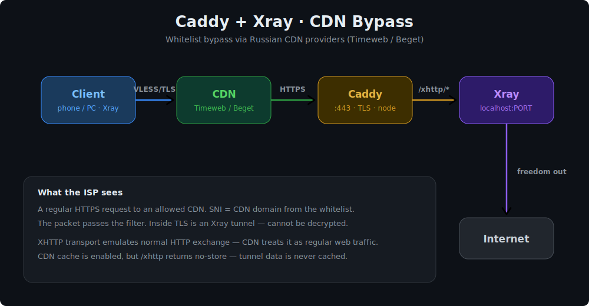

> English | **🌐 [Русский](README.ru.md)**

# Caddy + Xray CDN Setup


Automated setup of **Caddy + Xray (VLESS/XHTTP)** for bypassing ISP whitelists via CDN of Russian hosting providers — **Timeweb CDN** and **Beget CDN**.

---

## Why this exists

Some Russian ISPs enforce whitelists — only allowing traffic to a specific set of approved IPs/domains and blocking everything else. CDN servers of Russian hosting providers (Timeweb, Beget) are **on those whitelists** because they host legitimate websites.

The idea: route VPN traffic **through a CDN** that the ISP allows. To the ISP it looks like a regular HTTPS request to an approved CDN, but inside — an Xray tunnel.

> Cloudflare won't work for this — its IP ranges are frequently blocked or not whitelisted by Russian ISPs.

---

## How it works

### Architecture



### Step by step

1. **Client → CDN.**
   The Xray client establishes a VLESS connection over TLS to `cdn.yourdomain.com:443`. The `SNI` field contains the CDN domain. To the ISP this looks like a regular HTTPS request to a whitelisted CDN — the packet passes the filter.

2. **CDN → Origin (node).**
   The CDN receives the request on its technical domain `cdn.yourdomain.com` and proxies it to the origin server `node.yourdomain.com` over HTTPS. The CDN only sees an encrypted HTTP stream on the `/xhttp/*` path — it cannot decrypt the tunnel contents.

3. **Caddy on the node.**
   Caddy listens on `:443` for `node.yourdomain.com` with a valid TLS certificate (auto-issued by Let's Encrypt). Requests to `/xhttp/*` are reverse-proxied to local Xray (`127.0.0.1:PORT`). Everything else serves a static placeholder from `/var/www/html` — so the domain looks like a normal website if accessed directly.

4. **Xray.**
   Xray receives the VLESS/XHTTP stream, validates the client UUID, and releases decrypted traffic to the internet via the `freedom` outbound. Private/local addresses are blocked via `blackhole`.

### Why XHTTP (not WebSocket/gRPC)

XHTTP (`packet-up` mode) emulates regular HTTP request/response exchange — this is critical because **CDN operates at the HTTP level**. CDN caches, load-balances, and proxies HTTP requests. Many CDNs either cut WebSocket/gRPC connections or don't support connection upgrades properly. XHTTP looks like a stream of normal GET/POST requests split into sessions, which CDN passes through as-is.

The config parameters (`xPadding*`, `seqKey`, `sessionKey`, `xmux`) handle masking and multiplexing: padding in headers, splitting into "pages", and connection reuse — making the stream harder to distinguish from real web traffic.

### About CDN caching

**Caching in the CDN panel must be enabled.** The CDN needs to operate as a full caching proxy for whitelist bypass to work reliably.

However, the actual tunnel data is **never cached** because Caddy returns strict headers on the `/xhttp/*` path:

```
Cache-Control: private, proxy-revalidate, no-store, no-cache, must-revalidate, max-age=0
Pragma: no-cache
```

These headers tell the CDN "don't store this response" for dynamic tunnel traffic, while the caching mechanism on the CDN stays active. In short: **caching as a CDN feature is ON**, but **tunnel responses are not cached** thanks to the headers.

### Port security

The internal Xray port (default 10085) listens on **`127.0.0.1` only** and is blocked in UFW from external access. Xray can only be reached through Caddy, so traffic always passes through Caddy's TLS wrapper on the correct path. Externally only ports 22 (SSH), 80, and 443 are open.

---

## Requirements

| What | Details |
|------|---------|
| OS | Ubuntu 20.04+ / Debian 10+ |
| Access | root |
| DNS | A-record `node.yourdomain.com` → server IP |
| CDN | Timeweb CDN or Beget CDN |

---

## Quick start

```bash
bash <(curl -fsSL https://raw.githubusercontent.com/gkzgtzfv49-spec/Cdn-Whitelist/main/install.sh)
```

Or manually:

```bash
git clone https://github.com/gkzgtzfv49-spec/Cdn-Whitelist.git
cd Cdn-Whitelist
chmod +x install.sh
sudo bash install.sh
```

---

## Installation prompts

| Parameter | Example | Description |
|-----------|---------|-------------|
| Node domain | `node.yourdomain.com` | Server A-record, CDN origin |
| CDN domain | `cdn.yourdomain.com` | Technical CDN domain |
| Xray port | `10085` | Internal port (localhost only) |
| Fingerprint | `chrome` | Client TLS fingerprint |

UUID is auto-generated for each user.

---

## Management command

After installation, use:

```bash
xcdn
```

Opens the interactive menu:

```
Users
  1) Add user
  2) Delete user
  3) List users
  4) Show link / QR
  5) Update traffic
  6) Reset traffic
  7) Change expiry

System
  8)  Restart Xray
  9)  Restart Caddy
  10) Xray logs
  11) Caddy logs

Maintenance
  12) Backup configs
  13) Restore from backup
  14) Update script from GitHub
  15) Full uninstall
  0)  Exit
```

---

## VLESS link & QR

When adding a user, the script automatically outputs:
- a ready-to-import **VLESS link** for the client app,
- a **QR code** directly in the terminal (via `qrencode`),
- if `qrencode` is unavailable — a link to an online QR generator.

Link format:
```
vless://UUID@cdn.yourdomain.com:443?type=xhttp&path=%2Fxhttp&security=tls&sni=cdn.yourdomain.com&fp=chrome&mode=packet-up#username
```

---

## CDN setup after installation

### Timeweb CDN / Beget CDN

| Field | Value |
|-------|-------|
| Origin | `node.yourdomain.com` |
| HTTPS to origin | ✅ enabled |
| Caching | ✅ **enabled** |
| HTTP methods | GET, POST |

After creating the CDN resource you'll receive a technical domain — that's the `cdn.yourdomain.com` entered during installation.

---

## Server paths

| Path | Purpose |
|------|---------|
| `/etc/caddy/Caddyfile` | Caddy config |
| `/usr/local/etc/xray/config.json` | Xray config |
| `/usr/local/etc/xray/users.db` | User database |
| `/root/xray-cdn-params.txt` | Installation params |
| `/var/www/html/index.html` | Static placeholder |
| `/opt/xcdn/install.sh` | Script copy for `xcdn` command |
| `/usr/local/bin/xcdn` | Menu launch command |

---

## Verification

```bash
# Xray listening on internal port
ss -tlnp | grep 10085

# Caddy responds
curl -I https://node.yourdomain.com

# XHTTP path proxied to Xray
curl -v https://node.yourdomain.com/xhttp

# CDN reaches the node
curl -v https://cdn.yourdomain.com/xhttp
```

If all 4 commands respond — connect your client.

---

## Supported CDN

- **Timeweb CDN** — [timeweb.com](https://timeweb.com)
- **Beget CDN** — [beget.com](https://beget.com)

> Cloudflare is not suitable for whitelist bypass in Russia.

---

## Supported clients

CDN bypass with VLESS/XHTTP only works in these clients:

| Client | Platform | Link |
|--------|----------|------|
| **INCY** | iOS, Android, Windows, Linux, macOS, TV | [incy.cc](https://incy.cc) |
| **Shadowrocket** | iOS only | [App Store](https://apps.apple.com/app/shadowrocket/id932747118) |

> Other clients (v2rayNG, Hiddify, NekoBox, etc.) do not properly support XHTTP transport through CDN.

Copy the VLESS link or scan the QR code from the `xcdn` menu (option 4) and import it into the app.

---

## Troubleshooting

### Caddy won't start / port 443 busy

```bash
# Check what's using port 443
ss -tlnp | grep :443

# If nginx or apache is running, stop it
systemctl stop nginx
systemctl stop apache2

# Restart Caddy
systemctl restart caddy
journalctl -u caddy -n 30
```

### Xray won't start

```bash
# Check config syntax
xray run -test -c /usr/local/etc/xray/config.json

# Check logs
journalctl -u xray -n 30

# Common issue: empty clients array (no users added)
# Fix: add at least one user via xcdn menu
```

### CDN returns 502 / 504

- Caddy is not running → `systemctl restart caddy`
- Xray is not running → `systemctl restart xray`
- Wrong origin domain in CDN settings → must match `node.yourdomain.com`
- HTTPS to origin not enabled in CDN panel → enable it

### Connection works but very slow

- Try changing fingerprint to `random` (in client settings)
- Check if CDN caching is **enabled** in the CDN panel
- Try switching CDN provider (Timeweb ↔ Beget)

### Certificate not issued (Caddy)

- DNS A-record must point to the server IP **before** running the script
- Port 80 must be open (needed for ACME challenge)
- Check: `curl -I http://node.yourdomain.com` — should return Caddy response

### Client connects but no internet

- Check Xray outbound is `freedom` (not `blackhole`)
- Check server has internet: `curl -I https://google.com` from the server
- UFW might be blocking outbound — check `ufw status`

### "xcdn" command not found

```bash
# Reinstall the command
ln -sf /opt/xcdn/install.sh /usr/local/bin/xcdn
chmod +x /usr/local/bin/xcdn /opt/xcdn/install.sh
```

---

## Support the project

If this project helped you — you can support development with crypto.

| Network | Address |
|---------|---------|
| **BTC** | `bc1q02mq7savfqh64fqycpetlmcqdwvkmv2wdpngyr` |
| **ETH** | `0x974D109bB2c13bbAb0D0D01f1b6370c0b8036161` |
| **USDT (TRC-20)** | `TUZ6abgnWEin4Evyqdci245nQJ4Hf2gntC` |
| **TON** | `UQDQTBxaUcdsyNAw1XCyRUZukMANtlbfB0I8272FDxOJAVG4` |

---

## License

MIT
