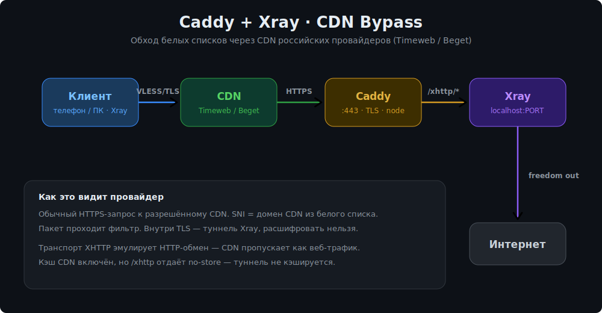

> **🌐 [English](README.md)** | Русский

# Caddy + Xray CDN Setup


Автоматическая установка и настройка **Caddy + Xray (VLESS/XHTTP)** для обхода белых списков (whitelist) через CDN российских провайдеров — **Timeweb CDN** и **Beget CDN**.

---

## Зачем это нужно

В России для обхода блокировок часто применяют «белые списки» (whitelist) — когда провайдер разрешает доступ только к ограниченному набору IP/доменов, а всё остальное режет. CDN российских провайдеров (Timeweb, Beget) **находятся в белых списках**, потому что на них хостятся легальные сайты.

Идея: пропустить VPN-трафик **через CDN**, который провайдер не блокирует. Для провайдера это выглядит как обычное HTTPS-обращение к разрешённому CDN, а внутри — туннель Xray.

> Cloudflare для этого не подходит — его IP-диапазоны в РФ часто не входят в белые списки и блокируются.

---

## Как это работает (технический уровень)

### Общая схема



### Что происходит по шагам

1. **Клиент → CDN.**
   Клиент Xray устанавливает VLESS-соединение поверх TLS на `cdn.yourdomain.com:443`. В поле `SNI` указан домен CDN. Для провайдера это выглядит как обычный HTTPS к разрешённому CDN — пакет проходит белый список.

2. **CDN → ориджин (нода).**
   CDN принимает запрос на технический домен `cdn.yourdomain.com` и проксирует его на источник (origin) — твой сервер `node.yourdomain.com` по HTTPS. CDN видит только зашифрованный HTTP-поток по пути `/xhttp/*`, расшифровать содержимое туннеля не может.

3. **Caddy на ноде.**
   Caddy слушает `:443` на `node.yourdomain.com`, держит валидный TLS-сертификат (Let's Encrypt, выпускается автоматически). Запросы по пути `/xhttp/*` он реверс-проксирует на локальный Xray (`127.0.0.1:PORT`). Всё остальное отдаёт как статический сайт-заглушку из `/var/www/html` — чтобы при прямом заходе домен выглядел обычным сайтом.

4. **Xray.**
   Xray принимает VLESS/XHTTP-поток, проверяет UUID клиента, и выпускает расшифрованный трафик в интернет через outbound `freedom`. Приватные/локальные адреса блокируются через `blackhole`.

### Почему транспорт XHTTP (а не WebSocket/gRPC)

XHTTP (`packet-up` режим) эмулирует обычный HTTP-обмен запросами/ответами — это критично, потому что **CDN работает на уровне HTTP**. CDN кэширует, балансирует и проксирует именно HTTP-запросы. WebSocket/gRPC многие CDN либо режут, либо не поддерживают апгрейд соединения корректно. XHTTP же выглядит как поток обычных GET/POST с разбивкой на сессии, что CDN пропускает «как есть».

Параметры в конфиге (`xPadding*`, `seqKey`, `sessionKey`, `xmux`) — это маскировка и мультиплексирование: добивка паддинга в заголовки, разбивка на «страницы» и переиспользование соединений, чтобы поток было сложнее отличить от настоящего веб-трафика.

### Про кэширование CDN

**Кэширование в панели CDN должно быть включено.** CDN для обхода whitelist работает как полноценный кэширующий прокси — без включённого кэша часть провайдеров/CDN рассматривает трафик иначе и обход не срабатывает стабильно.

При этом фактическое кэширование самого туннеля **не происходит**, потому что Caddy на пути `/xhttp/*` отдаёт строгие заголовки:

```
Cache-Control: private, proxy-revalidate, no-store, no-cache, must-revalidate, max-age=0
Pragma: no-cache
```

Эти заголовки говорят CDN «не сохраняй этот ответ» для динамического туннельного трафика, но при этом сам механизм кэширования на CDN остаётся активным. То есть: **кэш как функция CDN — включён**, а **туннельные ответы — не кэшируются** благодаря заголовкам. Так динамика туннеля не ломается, а CDN ведёт себя как ожидается.

### Безопасность портов

Внутренний порт Xray (по умолчанию 10085) слушает **только `127.0.0.1`** и закрыт в UFW снаружи. Достучаться до Xray можно только через Caddy → значит трафик всегда проходит TLS-обёртку Caddy и попадает по нужному пути. Снаружи открыты только 22 (SSH), 80 и 443.

---

## Требования

| Что | Детали |
|-----|--------|
| ОС | Ubuntu 20.04+ / Debian 10+ |
| Доступ | root |
| DNS | A-запись `node.yourdomain.com` → IP сервера |
| CDN | Timeweb CDN или Beget CDN |

---

## Быстрый старт

```bash
bash <(curl -fsSL https://raw.githubusercontent.com/SpecFlowdev/Cdn-Whitelist/main/install.sh)
```

Или вручную:

```bash
git clone https://github.com/SpecFlowdev/Cdn-Whitelist.git
cd Cdn-Whitelist
chmod +x install.sh
sudo bash install.sh
```

---

## Что скрипт спрашивает при установке

| Параметр | Пример | Описание |
|----------|--------|----------|
| Домен ноды | `node.yourdomain.com` | A-запись сервера, ориджин для CDN |
| Домен CDN | `cdn.yourdomain.com` | Технический домен CDN |
| Порт Xray | `10085` | Внутренний порт (только localhost) |
| Fingerprint | `chrome` | TLS fingerprint клиента |

UUID генерируется автоматически для каждого пользователя.

---

## Команда управления

После установки доступна команда:

```bash
xcdn
```

Открывает интерактивное меню:

```
Пользователи
  1) Добавить пользователя
  2) Удалить пользователя
  3) Список пользователей
  4) Показать ссылку / QR
  5) Обновить трафик
  6) Сбросить трафик
  7) Изменить срок действия

Система
  8)  Перезапустить Xray
  9)  Перезапустить Caddy
  10) Логи Xray
  11) Логи Caddy

Обслуживание
  12) Бэкап конфигов
  13) Восстановить из бэкапа
  14) Обновить скрипт из GitHub
  15) Полное удаление (uninstall)
  0)  Выйти
```

---

## VLESS ссылка и QR

При добавлении пользователя скрипт автоматически выводит:
- готовую **VLESS-ссылку** для импорта в клиент,
- **QR-код** прямо в терминале (через `qrencode`),
- если `qrencode` недоступен — ссылку на онлайн-генератор QR.

Формат ссылки:
```
vless://UUID@cdn.yourdomain.com:443?type=xhttp&path=%2Fxhttp&security=tls&sni=cdn.yourdomain.com&fp=chrome&mode=packet-up#username
```

---

## Настройка CDN после установки

### Timeweb CDN / Beget CDN

| Поле | Значение |
|------|----------|
| Источник (Origin) | `node.yourdomain.com` |
| HTTPS к источнику | ✅ включено |
| Кэширование | ✅ **включено** |
| HTTP методы | GET, POST |

После создания CDN-ресурса получишь технический домен — это и есть `cdn.yourdomain.com`, который вводился при установке.

---

## Пути на сервере

| Путь | Назначение |
|------|-----------|
| `/etc/caddy/Caddyfile` | Конфиг Caddy |
| `/usr/local/etc/xray/config.json` | Конфиг Xray |
| `/usr/local/etc/xray/users.db` | База пользователей |
| `/root/xray-cdn-params.txt` | Параметры установки |
| `/var/www/html/index.html` | Заглушка для прямых запросов |
| `/opt/xcdn/install.sh` | Копия скрипта для команды `xcdn` |
| `/usr/local/bin/xcdn` | Команда запуска меню |

---

## Проверка

```bash
# Xray слушает внутренний порт
ss -tlnp | grep 10085

# Caddy отвечает
curl -I https://node.yourdomain.com

# Путь XHTTP проксируется в Xray
curl -v https://node.yourdomain.com/xhttp

# CDN достигает ноды
curl -v https://cdn.yourdomain.com/xhttp
```

Если все 4 команды отвечают — можно подключать клиента.

---

## Сгенерированные конфиги

Скрипт автоматически создаёт эти файлы на основе введённых параметров. Приведены для справки.

### Caddyfile — `/etc/caddy/Caddyfile`

```
node.yourdomain.com {
    handle /xhttp/* {
        header {
            Cache-Control "private, proxy-revalidate, no-store, no-cache, must-revalidate, max-age=0"
            Accept "application/vnd.api+json, application/json, text/plain, */*"
            Pragma "no-cache"
            Accept-Language "ru-RU,ru;q=0.9,en-US;q=0.8,en;q=0.7"
        }
        reverse_proxy 127.0.0.1:10085 {
            flush_interval -1
        }
    }
    handle {
        root * /var/www/html
        file_server
    }
}
```

Caddy автоматически выпускает и обновляет TLS-сертификат Let's Encrypt для `node.yourdomain.com`. Весь трафик на `/xhttp/*` реверс-проксируется в Xray на localhost — снаружи недоступно. Всё остальное отдаёт статическую страницу-заглушку.

### Конфиг Xray — `/usr/local/etc/xray/config.json`

```json
{
  "log": { "loglevel": "warning" },
  "dns": {
    "servers": [
      "https://1.1.1.1/dns-query",
      "https://8.8.8.8/dns-query"
    ]
  },
  "inbounds": [
    {
      "tag": "xhttp-cdn",
      "port": 10085,
      "listen": "127.0.0.1",
      "protocol": "vless",
      "settings": {
        "clients": [
          { "id": "<UUID>", "email": "<имя_пользователя>", "flow": "" }
        ],
        "decryption": "none"
      },
      "sniffing": {
        "enabled": true,
        "destOverride": ["http", "tls", "quic"]
      },
      "streamSettings": {
        "network": "xhttp",
        "security": "none",
        "xhttpSettings": {
          "mode": "packet-up",
          "path": "/xhttp",
          "extra": {
            "path": "/xhttp",
            "xmux": {
              "cMaxLifetimeMs": 0,
              "cMaxReuseTimes": 0,
              "maxConcurrency": "16-32",
              "maxConnections": 0
            },
            "seqKey": "page",
            "sessionKey": "X-Auth-Token",
            "xPaddingKey": "_dc",
            "seqPlacement": "query",
            "xPaddingHeader": "X-Cache",
            "xPaddingMethod": "tokenish",
            "sessionPlacement": "header",
            "uplinkHTTPMethod": "GET",
            "xPaddingObfsMode": true,
            "xPaddingPlacement": "header"
          },
          "channels": 4,
          "uploadPath": "/xhttp/up",
          "noSSEHeader": false,
          "downloadPath": "/xhttp/dl",
          "scavengeWindow": 10
        }
      }
    }
  ],
  "outbounds": [
    { "tag": "DIRECT", "protocol": "freedom" },
    { "tag": "BLOCK",  "protocol": "blackhole" }
  ],
  "routing": {
    "rules": [
      {
        "ip": ["geoip:private"],
        "type": "field",
        "outboundTag": "BLOCK"
      }
    ],
    "domainStrategy": "IPIfNonMatch"
  }
}
```

Ключевые моменты:
- Xray слушает только **127.0.0.1:10085** — снаружи недоступен
- Транспорт: **XHTTP** в режиме `packet-up` — выглядит как обычный HTTP-обмен с API для CDN
- Параметры `xPadding*` добавляют рандомизированные заголовки для усложнения фингерпринтинга
- `xmux` мультиплексирует потоки внутри одного соединения с рандомным concurrency 16–32
- UUID и email (имя пользователя) добавляются автоматически при создании юзеров через `xcdn`

---

## Поддерживаемые CDN

- **Timeweb CDN** — [timeweb.com](https://timeweb.com)
- **Beget CDN** — [beget.com](https://beget.com)

> Cloudflare не подходит для обхода белых списков в России.

---

## Поддерживаемые клиенты

CDN-обход с VLESS/XHTTP работает только в этих клиентах:

| Клиент | Платформа | Ссылка |
|--------|-----------|--------|
| **INCY** | iOS, Android, Windows, Linux, macOS, TV | [incy.cc](https://incy.cc) |
| **Shadowrocket** | только iOS | [App Store](https://apps.apple.com/app/shadowrocket/id932747118) |

> Другие клиенты (v2rayNG, Hiddify, NekoBox и т.д.) не поддерживают XHTTP-транспорт через CDN корректно.

Скопируй VLESS-ссылку или отсканируй QR из меню `xcdn` (пункт 4) и импортируй в приложение.

---

## Решение проблем

### Caddy не запускается / порт 443 занят

```bash
# Проверь что занимает порт
ss -tlnp | grep :443

# Если nginx или apache работает — останови
systemctl stop nginx
systemctl stop apache2

# Перезапусти Caddy
systemctl restart caddy
journalctl -u caddy -n 30
```

### Xray не запускается

```bash
# Проверь конфиг
xray run -test -c /usr/local/etc/xray/config.json

# Логи
journalctl -u xray -n 30

# Частая причина: пустой массив clients (нет юзеров)
# Решение: добавь хотя бы одного через xcdn
```

### CDN отдаёт 502 / 504

- Caddy не запущен → `systemctl restart caddy`
- Xray не запущен → `systemctl restart xray`
- Неправильный домен origin в CDN → должен совпадать с `node.yourdomain.com`
- HTTPS к источнику не включён в панели CDN → включи

### Подключение есть, но медленно

- Попробуй fingerprint = `random` в настройках клиента
- Проверь что кэширование **включено** в панели CDN
- Попробуй сменить CDN (Timeweb ↔ Beget)

### Сертификат не выпускается (Caddy)

- A-запись должна вести на IP сервера **до** запуска скрипта
- Порт 80 должен быть открыт (нужен для ACME)
- Проверь: `curl -I http://node.yourdomain.com`

### Клиент подключается, но нет интернета

- Проверь outbound в Xray = `freedom` (не `blackhole`)
- Проверь интернет на сервере: `curl -I https://google.com`
- UFW блокирует исходящие → `ufw status`

### Команда "xcdn" не найдена

```bash
ln -sf /opt/xcdn/install.sh /usr/local/bin/xcdn
chmod +x /usr/local/bin/xcdn /opt/xcdn/install.sh
```

---

## Поддержать проект

Если проект оказался полезным — можно поддержать разработку криптой.

| Сеть | Адрес |
|------|-------|
| **BTC** | `bc1q02mq7savfqh64fqycpetlmcqdwvkmv2wdpngyr` |
| **ETH** | `0x974D109bB2c13bbAb0D0D01f1b6370c0b8036161` |
| **USDT (TRC-20)** | `TUZ6abgnWEin4Evyqdci245nQJ4Hf2gntC` |
| **TON** | `UQDQTBxaUcdsyNAw1XCyRUZukMANtlbfB0I8272FDxOJAVG4` |

---

## Лицензия

MIT
